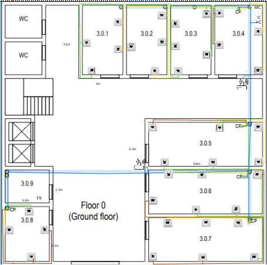
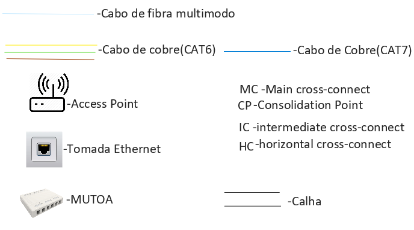

#RCOMP 2021-2022 Project - Sprint 1 - Member 1200601 folder

#Introdução

Este projeto tem como objetivo criar uma estrutura de cabeamento em cinco
edifícios, cada edifícios está associado a um número. A equipa decidiu que cada membro ficaria
com um edifício para planear o cabeamento do mesmo, no meu caso, fiquei com o edifício 3.

A imagem abaixo mostra o posicionamento dos edifícios, sendo o edifício 1 o data center.
Também se é mostrado os cabos situados a baixo da terra para mostrar a conexão entre todos os edifícios:

#Edifício 3

O edifício 3 tem uma área de 400 metros quadrados e tem dois pisos, sendo que o rés do chão tem 11 salas sendo que
duas delas são casas de banhos, os professores envolvidos neste projeto informaram-nos
que não seria necessário relacionar qualquer tipo de cabeamento nestas duas salas. 
O piso 1 tem 12 salas sendo que duas também são casas de banho, a mesma regra indicada anteriormente
também se aplica aqui.

#Cabeamento do Rés-do-chão

Começemos por apresentar a planta do rés do chão e o seu respetivo cabeamento:

**Planta Rés-do-chão**

**Cabeamento do Rés-do-chão (ver svg para uma melhor inspeção)**

**Legenda:**

**Informações de cada sala:**

| Sala               | Área      | Outlets   | CP                                    |
|:-------------------|:----------|:----------|:--------------------------------------|
| 3.0.1              | 15.6 m^2  | 4 Outlets | 0                                     |
| 3.0.2              | 15.6 m^2  | 4 Outlets | 0                                     |
| 3.0.3              | 15.6 m^2  | 4 Outlets | 0                                     |
| 3.0.4 (datacentre) | 18.44 m^2 | 4 Outlets | 1 (Switch e patch panel de 24 portas) |
| 3.0.5              | 29.04 m^2 | 6 Outlets | 1 (Switch e patch panel de 12 portas  |
| 3.0.6              | 29.04 m^2 | 6 Outlets | 1 (Switch e patch panel de 12 portas) |
| 3.0.7              | 29.04 m^2 | 6 Outlets | 1 (Switch e patch panel de 12 portas) |
| 3.0.8              | 14 m^2    | 4 Outlets | 1 (Switch e patch panel de 12 portas) |
| 3.0.9              | 7.82 m^2  | 0 Outlets | 0                                     |

**Tabela de Materiais:**

#Justificação dos materiais usados e do posicionamento dos mesmos

* Devido á natureza da sala 3.0.4, esta foi selecionada para ser o data center
deste piso, foi colocado o **HC**, o **IC** e um **CP** que faz conexão com as salas 3.0.1 até 3.0.4.

* O cabo **CAT7** é utilizado para conectar os **CPs**,**HC** e o **AP** entre eles, permitindo
assim um alto nível de tráfego de dados.Para alimentação dos AP o cabo CAT7 irá utilizar a tecnologia POE para alimentar de energia elétrica os equipamentos. Irão ser utilizados Power Injectors para permitir ao cabo transportar energia elétrica. Estes dispositivos irão ser colocados na saida do HC para assim alimentar a ligação.

* Devido às paredes de betão armado que existem no piso, temos em consideração
que o raio do **AP** desce 10 metros que o normal.

* Os cabos **CAT6** e **CAT7** percorrem a maior parte do edifício através das
calhas subterrâneas que foram previemente estabelecidas no edifício. 

#Cabeamento do Piso 1
    
**Planta do Piso 1:**

**Cabeamento do Piso 1 (ver svg para uma melhor inspeção)**

**Legenda:**

| Sala   | Área      | Outlets   | CP                                    |
|:-------|:----------|:----------|:--------------------------------------|
| 3.1.1  | 24 m^2    | 6 Outlets | 0                                     |
| 3.1.2  | 24 m^2    | 6 Outlets | 1 (Switch e patch panel de 24 portas) |
| 3.1.3  | 21.6 m^2  | 6 Outlets | 1 (Switch e patch panel de 24 portas) |
| 3.1.4  | 32.8 m^2  | 8 Outlets | 0                                     |
| 3.1.5  | 32.8 m^2  | 8 Outlets | 1 (Switch e patch panel de 12 portas  |
| 3.1.6  | 21.6 m^2  | 6 Outlets | 0                                     |
| 3.1.7  | 42.7 m^2  | 8 Outlets | 1 (Switch e patch panel de 24 portas) |
| 3.1.8  | 42.7 m^2  | 8 Outlets | 0                                     |
| 3.1.9  | 42.7 m^2  | 8 Outlets | 1 (Switch e patch panel de 12 portas)                                     |
| 3.1.10 | 13.44 m^2 | 4 Outlets | 0                                     |

**Tabela de Materiais:**

#Explicação da Seleção dos Materiais Usados

* Colocou-se um **MUTOA** nas salas: 3.1.1,3.1.2,3.1.7 e 3.1.9 uma vez que existe uma área ampla no meio da sala 
e assumindo que haverá um elevado número de utilizadores nestas salas,  usou-se calhas
para esconder e organizar os cabos, sendo esta colada ao chão.

* O cabo **CAT7** é utilizado para conectar os **CPs**,**HC** e o **AP** entre eles, permitindo
assim um alto nível de tráfego de dados.Para alimentação dos AP o cabo CAT7 irá utilizar a tecnologia POE para alimentar de energia elétrica os equipamentos. Irão ser utilizados Power Injectors para permitir ao cabo transportar energia elétrica. Estes dispositivos irão ser colocados na saida do HC para assim alimentar a ligação.

* Usou-se calhas para que certos outlets podessem ser colocadas no meio da sala para
que os utilizadores podessem aceder ás outlets numa distância máxima de 2 metros.