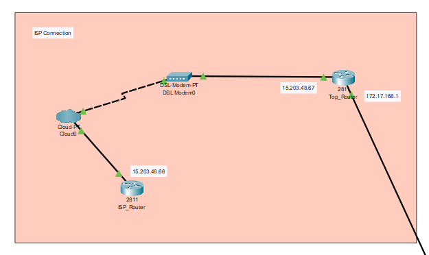
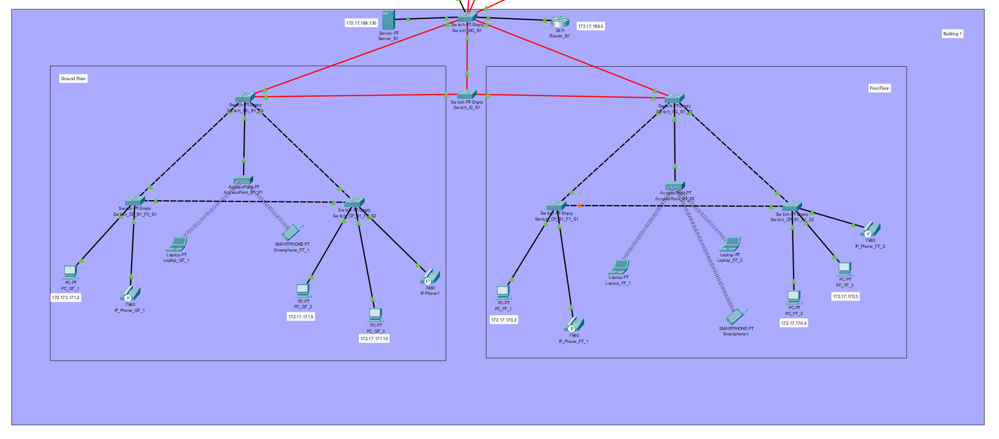
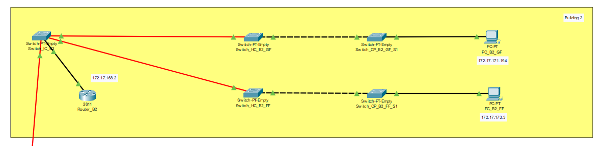
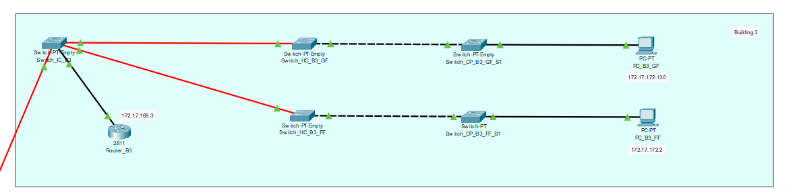
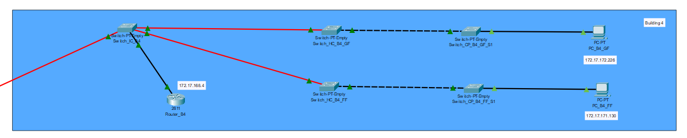
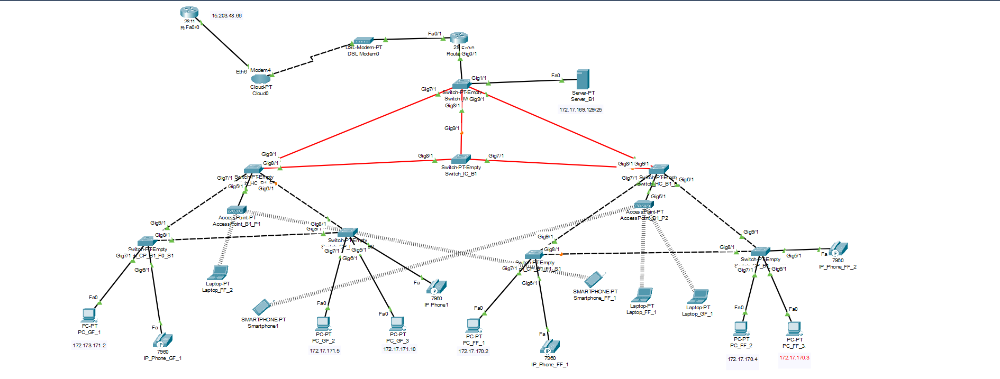
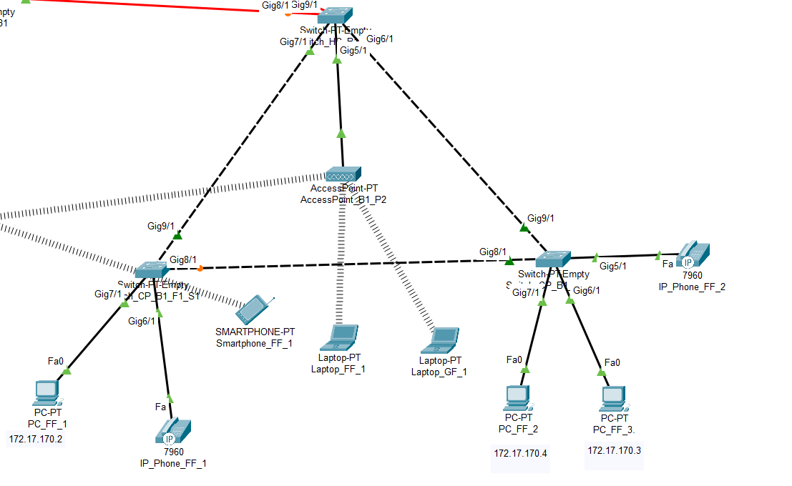
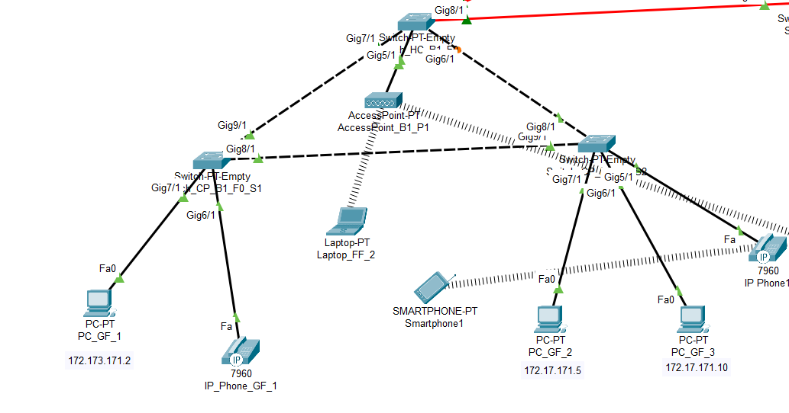

# RCOMP 2021-2022 Project - Sprint 2 - Member 1200920 folder
===========================================

## ***Edifício 1***

#### Durante a realização do Sprint 2 de RCOMP, foi desenvolvida, no 'Cisco Packet Tracer', uma simulação da rede anteriormente realizada no sprint 1, para cada edifício. Cada elemento teve de adaptar as suas VLANs, as quais se encontram definidas no planning, e os respetivos IPs (IPv4 Networks) com uma simulação funcional.

###

## *Simulação total do Campus*

### *ISP Connection*

### *Building 1 Connection*

### *Building 2 Connection*

### *Building 3 Connection*

### *Building 4 Connection*

## *Simulação total do edifício 1*

### *Floor 0*

### *Floor 1*

### *Notas:*

* Uma vez que não era necessário neste sprint, não foi configurado **DNS** utilizando um servidor próprio para tal.

* Foi configurada uma DHCP Pool no router, chamada **"Wifi_B1"**, que está encarregue de atribuir enderenços **IPv4** a todos os dipositivos que se liguem de forma wireless à rede.

* Os **VoIP phones** não foram configurados. Apenas se desligou as VLANs nas portas entre **switch** e **VoIP phone**.

* Para uma melhor compreensão, foi anotado, debaixo dos end nodes, os seus respetivos endereços, exceto nos portáteis e telemóveis, visto que estes têm o **DHCP** ativado. Estão, também, descritas as informações relativas aos **switches**.

* Todos os configs relacionados ao **router** e os vários **switches** encontram-se na pasta "config", por uma questão de melhor organização dos ficheiros.

* A **árvore dos endereços** e a sua respetiva legenda encontram-se, em formato **jpg**, na pasta de cada elemento do grupo.

* A **simulação de rede do campus** encontra-se na pasta do sprint master (1200902) e do elemento que está encarregue do edifício 1 (1200920).

### *Informação sobre o edifício:*

- Backbone: 120 nodes
- End user outlets on the ground floor: 60 nodes
- End user outlets on floor one: 80 nodes
- Wi-Fi network: 120 nodes
- Local servers and administration workstations (DMZ): 100 nodes
- VoIP (IP-phones): 40 nodes

#

### Distribuição da rede

| VLAN NAME | VLAN ID | REQUESTED NODES | SUB NETWORK ADDRESS | MASK            | ADDRESS RANGE      | NETWORK ADDRESS | BROADCAST ADDRESS | FIRST VALID NODE ADDRESS | LAST VALID NODE ADDRESS |
|-----------|---------|-----------------|---------------------|-----------------|--------------------|-----------------|-------------------|--------------------------|-------------------------|
| BACKBONE  | 365     | 120             | 172.17.168.0        | 255.255.255.128 | 172.17.168.0-127   | 172.17.168.0    | 172.17.168.127    | 172.17.168.1             | 172.17.168.127          |
| GF_B1     | 366     | 60              | 172.17.171.0        | 255.255.255.192 | 172.17.171.0-63    | 172.17.171.0    | 172.17.171.63     | 172.17.171.1             | 172.17.171.63           |
| FF_B1     | 367     | 80              | 172.17.170.0        | 255.255.255.128 | 172.17.170.0-127   | 172.17.170.0    | 172.17.170.127    | 172.17.170.1             | 172.17.170.127          |
| WIFI_B1   | 368     | 120             | 172.17.168.128      | 255.255.255.128 | 172.17.168.128-255 | 172.17.168.128  | 172.17.168.255    | 172.17.168.129           | 172.17.168.255          |
| DMZ_B1    | 369     | 100             | 172.17.169.128      | 255.255.255.128 | 172.17.169.128-255 | 172.17.169.128  | 172.17.169.255    | 172.17.169.129           | 172.17.169.255          |
| VoIP_B1   | 370     | 40              | 172.17.172.64       | 255.255.255.128 | 172.17.172.64-127  | 172.17.172.64   | 172.17.172.127    | 172.17.172.65            | 172.17.172.127          |

## SubInterfaces

| VLAN NAME | VLAN ID | SUBINTERFACE        | IP ADDRESS     | MASK            |
|:----------|:--------|:--------------------|:---------------|:----------------|
| GF_B1     | 366     | FastEthernet1/0.366 | 172.17.171.0   | 255.255.255.192 |
| FF_B1     | 367     | FastEthernet1/0.367 | 172.17.170.0   | 255.255.255.128 |
| WIFI_B1   | 368     | FastEthernet1/0.368 | 172.17.168.128 | 255.255.255.128 |
| DMZ_B1    | 369     | FastEthernet1/0.369 | 172.17.169.128 | 255.255.255.128 |
| VoIP_B1   | 370     | FastEthernet1/0.370 | 172.17.172.64  | 255.255.255.128 |

## Routing table

### Router B1
| Network        | Mask            | Next Hop       |
|----------------|-----------------|----------------|
| 0.0.0.0        | 0.0.0.0         | 172.17.168.1   |

### TopRouter
| Network        | Mask             | Next Hop     |
|----------------|------------------|--------------|
| 172.17.171.0   | 255.255.255.192  | 172.17.168.5 |
| 172.17.170.0   | 255.255.255.128  | 172.17.168.5 |
| 172.17.168.128 | 255.255.255.128  | 172.17.168.5 |
| 172.17.169.128 | 255.255.255.128  | 172.17.168.5 |
| 172.17.172.64  | 255.255.255.192  | 172.17.168.5 |
| 172.17.173.0   | 255.255.255.224  | 172.17.168.2 |
| 172.17.171.192 | 255.255.255.192  | 172.17.168.2 |
| 172.17.169.0   | 255.255.255.128  | 172.17.168.2 |
| 172.17.173.64  | 255.255.255.240  | 172.17.168.2 |
| 172.17.173.96  | 255.255.255.240  | 172.17.168.2 |
| 172.17.172.128 | 255.255.255.192  | 172.17.168.3 |
| 172.17.172.0   | 255.255.255.192  | 172.17.168.3 |
| 172.17.171.64  | 255.255.255.192  | 172.17.168.3 |
| 172.17.172.192 | 255.255.255.224  | 172.17.168.3 |
| 172.17.173.32  | 255.255.255.224  | 172.17.168.3 |
| 172.17.172.224 | 255.255.255.224  | 172.17.168.3 |
| 172.17.172.224 | 255.255.255.224  | 172.17.168.4 |
| 172.17.171.128 | 255.255.255.192  | 172.17.168.4 |
| 172.17.170.128 | 255.255.255.128  | 172.17.168.4 |
| 172.17.173.128 | 255.255.255.240  | 172.17.168.4 |
| 172.17.173.112 | 255.255.255.240  | 172.17.168.4 |
| 0.0.0.0        | 0.0.0.0          | 15.203.48.66 |

###

## Explicações e observações

* O router apresenta um default route, conseguido através do endereço **0.0.0.0/0**, assim, este redireciona, quando tráfego relativo a **IPs desconhecidos**, para o **Top Router**.

* A simulação permite a comunicação entre **VLANs** (utilizando **Default Gateways**). Cada **router** encaminha qualquer endereço que não conhece para o **router** presente no MC e este encaminha para cada edifício, caso este esteja compreeendido entre os endereços do **campus**. No caso de não estar, dá forward para o **ISP** através de um **DSL Modem** (sendo esta solução representada apenas no ficheiro campus.pkt, localizado na pasta relativa ao Edifício 1).

* Todas as ligações entre switches foram alteradas para se apresentarem em **trunk mode**, o **VTP domain** foi alterado para o domínio fornecido no enunciado (**rc22djg1**) e o switch do MC foi configurado para estar em **modo server**, sendo os restantes switches configurados para estarem no **modo client**. Assim, permitimos que todos os **switches tenham todas as VLANs na sua VLAN database** configuradas para o edifício e campus (VLAN IDs no **intervalo de 365 – 395** e descritas no ficheiro planning.md).

* Na configuração deste edifício, podemos verificar tanto o IC, bem como os dois HCs e os quatro CPs, estão representados por switches **"PT-Empty"**, tal como mencionado no enunciado.

* O modelo do router utilizado foi o *2811*, tal como mencionado no enunciado do projeto.

* Por outro lado, conectados aos APs, estão laptops e smartphones preparados e ligados através de WiFi à VLAN referente à WiFi Network do Edifício 4 (VLAN ID: 383).

* SSIDs e canais foram configurados nos Access Points (também representados nas imagens).

* Tal como mencionado previamente, o DHCP foi configurado numa Pool "WIFI_B1" permitindo, assim, a atribuição automática de enderenços IPv4 a todos os end nodes que tenham o DCHP ligado.
