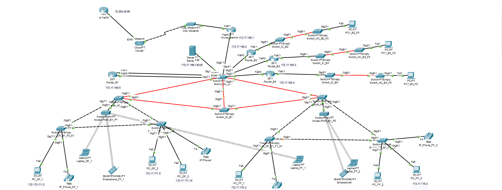

# RCOMP 2021-2022 Project - Sprint 2 - Member 1200920 folder

## ***Edifício 1***

### 
 Durante a realização do Sprint 2 de RCOMP foi desenvolvido, por edifício, uma simulação da rede desenvolvida no sprint 1 no "Cisco Packet Tracer". Cada elemento teve de adaptar as suas VLANs, definidas no planning, e os respetivos IPs (IPV4 Network) com uma simulação funcional representando o mesmo.

# 

### *Imagem da simulação total do BackBone*:

### *Imagem da simulação total do edifício 1*:

### *Piso 0:*

### *Piso 1:*

### 
 *Notas*:
* Uma vez que neste sprint não era necessário, não foi configurado **DNS** utilizando um servidor próprio para o mesmo;
* Foi configurado uma DHCP pool no router, chamada **"WIFI_B1"**, que está encarregue de atribuir endereços **IPv4** a todos os diapositivos que se liguem de forma wireless à rede.
* Não foram configurados os **VoIP phones**, apenas foram desligadas, nos respetivos ports entre **switch** e **VoIP phone**, as **VLANs**.
* Para uma melhor compreensão foi anotado debaixo dos end nodes os seus respetivos endereços, menos nos portáteis e telemóveis, pois os mesmos tem o **DHCP** ativado. Também está disponibilizado as informações dos **switches**.
* Todos os configs relacionados ao **router** e **switches** encontram se na pasta "config" para uma melhor organização dos ficheiros.

#

### *Informação sobre o edifício*:

- End user outlets on the ground floor: 60 nodes
- End user outlets on floor one: 80 nodes
- Wi-Fi network: 120 nodes
- Local servers and administration workstations (DMZ): 100 nodes
- VoIP (IP-phones): 40 nodes
- Backbone: 120 nodes

#

### Distribuição da rede

| VLAN NAME | VLAN ID | REQUESTED NODES | SUB NETWORK ADDRESS | MASK            | ADDRESS RANGE      | NETWORK ADDRESS | BROADCAST ADDRESS | FIRST VALID NODE ADDRESS | LAST VALID NODE ADDRESS |
| :-------- | :------ | :-------------- | :------------------ | :-------------- | :----------------- | :-------------- | :---------------- | :----------------------- | :---------------------- |
| BACKBONE  | 365     | 120             | 172.17.168.0        | 255.255.255.128 | 172.17.168.0-127   | 172.17.168.0    | 172.17.168.127    | 172.17.168.1             | 172.17.168.127          |
| GF_B1     | 366     | 60              | 172.17.171.0        | 255.255.255.192 | 172.17.171.0-63    | 172.17.171.0    | 172.17.171.63     | 172.17.171.1             | 172.17.171.63           |
| FF_B1     | 367     | 80              | 172.17.170.0        | 255.255.255.128 | 172.17.170.0-127   | 172.17.170.0    | 172.17.170.127    | 172.17.170.1             | 172.17.170.127          |
| WIFI_B1   | 368     | 120             | 172.17.168.128      | 255.255.255.128 | 172.17.168.128-255 | 172.17.168.128  | 172.17.168.255    | 172.17.168.129           | 172.17.168.255          |
| DMZ_B1    | 369     | 100             | 172.17.169.128      | 255.255.255.128 | 172.17.169.128-255 | 172.17.169.128  | 255.255.255.255   | 172.17.169.129           | 172.17.169.255          |
| VoIP_B1   | 370     | 40              | 172.17.172.64       | 255.255.255.128 | 172.17.172.64-127  | 172.17.172.64   | 172.17.172.127    | 172.17.172.65            | 172.17.172.127          |

# Routing table
## Router B1
| Network        | Mask            | Next Hop       |
| -------------- | --------------- | -------------- |
| 0.0.0.0        | 0.0.0.0         | 172.17.168.1   |
| 172.17.171.0   | 255.255.255.192 | 172.17.168.1   |
| 172.17.170.0   | 255.255.255.128 | 172.17.168.1   |
| 172.17.168.128 | 255.255.255.128 | 172.17.168.1   |
| 172.17.169.128 | 255.255.255.128 | 172.17.168.1   |
| 172.17.168.0   | 255.255.255.128 | 172.17.171.0   |
| 172.17.168.0   | 255.255.255.128 | 172.17.170.0   |
| 172.17.168.0   | 255.255.255.128 | 172.17.168.128 |
| 172.17.168.0   | 255.255.255.128 | 172.17.169.128 |
| 172.17.168.0   | 255.255.255.128 | 172.17.172.64  |

## Router BackBone
| Network        | Mask            | Next Hop     |
| -------------- | --------------- | ------------ |
| 0.0.0.0        | 0.0.0.0         | 15.203.48.66 |
| 172.17.173.0   | 255.255.255.224 | 172.17.168.5 |
| 172.17.171.192 | 255.255.255.192 | 172.17.168.5 |
| 172.17.169.0   | 255.255.255.128 | 172.17.168.5 |
| 172.17.173.64  | 255.255.255.240 | 172.17.168.5 |
| 172.17.173.96  | 255.255.255.240 | 172.17.168.5 |
| 172.17.172.128 | 255.255.255.192 | 172.17.168.5 |
| 172.17.172.0   | 255.255.255.192 | 172.17.168.5 |
| 172.17.171.64  | 255.255.255.192 | 172.17.168.5 |
| 172.17.172.192 | 255.255.255.224 | 172.17.168.5 |
| 172.17.173.32  | 255.255.255.224 | 172.17.168.5 |
| 172.17.172.224 | 255.255.255.224 | 172.17.168.5 |
| 172.17.171.128 | 255.255.255.192 | 172.17.168.5 |
| 172.17.170.128 | 255.255.255.128 | 172.17.168.5 |
| 172.17.173.128 | 255.255.255.240 | 172.17.168.5 |
| 172.17.173.112 | 255.255.255.240 | 172.17.168.5 |
| 172.17.168.0   | 255.255.255.128 | 172.17.168.2 |
| 172.17.171.0   | 255.255.255.192 | 172.17.168.2 |
| 172.17.170.0   | 255.255.255.128 | 172.17.168.2 |
| 172.17.168.128 | 255.255.255.128 | 172.17.168.2 |
| 172.17.169.128 | 255.255.255.128 | 172.17.168.2 |
| 172.17.172.128 | 255.255.255.192 | 172.17.168.2 |
| 172.17.172.0   | 255.255.255.192 | 172.17.168.2 |
| 172.17.171.64  | 255.255.255.192 | 172.17.168.2 |
| 172.17.172.192 | 255.255.255.224 | 172.17.168.2 |
| 172.17.173.32  | 255.255.255.224 | 172.17.168.2 |
| 172.17.172.224 | 255.255.255.224 | 172.17.168.2 |
| 172.17.171.128 | 255.255.255.192 | 172.17.168.2 |
| 172.17.170.128 | 255.255.255.128 | 172.17.168.2 |
| 172.17.173.128 | 255.255.255.240 | 172.17.168.2 |
| 172.17.173.112 | 255.255.255.240 | 172.17.168.2 |
| 172.17.171.0   | 255.255.255.192 | 172.17.168.3 |
| 172.17.170.0   | 255.255.255.128 | 172.17.168.3 |
| 172.17.168.128 | 255.255.255.128 | 172.17.168.3 |
| 172.17.169.128 | 255.255.255.128 | 172.17.168.3 |
| 172.17.172.64  | 255.255.255.192 | 172.17.168.3 |
| 172.17.173.0   | 255.255.255.224 | 172.17.168.3 |
| 172.17.171.192 | 255.255.255.192 | 172.17.168.3 |
| 172.17.169.0   | 255.255.255.128 | 172.17.168.3 |
| 172.17.173.64  | 255.255.255.240 | 172.17.168.3 |
| 172.17.173.96  | 255.255.255.240 | 172.17.168.3 |
| 172.17.172.224 | 255.255.255.224 | 172.17.168.3 |
| 172.17.171.128 | 255.255.255.192 | 172.17.168.3 |
| 172.17.170.128 | 255.255.255.128 | 172.17.168.3 |
| 172.17.173.128 | 255.255.255.240 | 172.17.168.3 |
| 172.17.173.112 | 255.255.255.240 | 172.17.168.3 |
| 172.17.171.0   | 255.255.255.192 | 172.17.168.4 |
| 172.17.170.0   | 255.255.255.128 | 172.17.168.4 |
| 172.17.168.128 | 255.255.255.128 | 172.17.168.4 |
| 172.17.169.128 | 255.255.255.128 | 172.17.168.4 |
| 172.17.172.64  | 255.255.255.192 | 172.17.168.4 |
| 172.17.173.0   | 255.255.255.224 | 172.17.168.4 |
| 172.17.171.192 | 255.255.255.192 | 172.17.168.4 |
| 172.17.169.0   | 255.255.255.128 | 172.17.168.4 |
| 172.17.173.64  | 255.255.255.240 | 172.17.168.4 |
| 172.17.173.96  | 255.255.255.240 | 172.17.168.4 |
| 172.17.172.128 | 255.255.255.192 | 172.17.168.4 |
| 172.17.172.0   | 255.255.255.192 | 172.17.168.4 |
| 172.17.171.64  | 255.255.255.192 | 172.17.168.4 |
| 172.17.172.192 | 255.255.255.224 | 172.17.168.4 |
| 172.17.173.32  | 255.255.255.224 | 172.17.168.4 |

### Explicações e observações

* O route apresenta um default route conseguido através do endereço **0.0.0.0/0**, assim, este redireciona, quando tráfego relativo a **IPs desconhecidos**, para o **router do ISP**.

* A simulação permite a comunicação entre **VLANs** (utilizando **Default Gateways**). Cada **router** encaminha qualquer endereço que não conhece para o **router** presente no MC e este encaminha para cada edifício caso este esteja compreeendido entre os endereços do **Campus**. Caso não esteja, dá foward para o **ISP** através de um **DSL Modem** (sendo esta solução representada apenas no ficheiro campus.pkt localizado na pasta relativa ao Edifício 1).

* Todas as ligações entre switches foram alteradas para se apresentarem em **truck mode**, o **vtp domain** mudado para o domínio fornecido no enunciado (**rc22djg1**) e o switch do MC foi configurado para estar em **modo server**, sendo os restantes switches configurados para estarem no **modo client**, assim permitimos que todos os **switches tenham na sua VLAN database todas as VLANs** configuradas para o edifício e campus (VLAN IDs no **intervalo 365 - 395** e descritas no ficheiro planning.md).
  
  
* Nesta imagem, podemos verificar que o IC, bem como os dois HCs e os quatro CPs estão representados por Switches **"PT-Empty"**, como pedido pelo enunciado. 

* O modelo do router utilizado foi o *2811* tal como mencionado no enunciado do projeto.

* Por outro lado, ligados aos APs, estão laptops e smartphones preparados e ligados através de WiFi à VLAN referente à WiFi Network do Edifício 4 (VLAN ID: 383).

* SSIDS e canais configurados nos Access Points (também representados nas imagens).

* Tal como mencionado previamente, o DHCP foi configurado numa pool "WIFI_B1" permitindo assim a atribuição automática de endereços IPv4 a todos os end nodes que tenham o DCHP ligado. 
    
