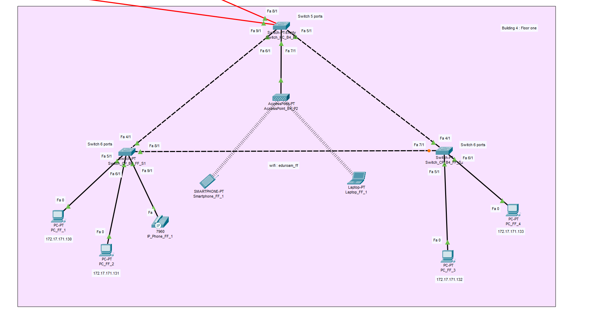

RCOMP 2021-2022 Project - Sprint 2 - Member 1201487 folder
===========================================

## ***Edifício 4***

### 
 Durante a realização do Sprint 2 de RCOMP foi desenvolvido, por edifício, uma simulação da rede desenvolvida no sprint 1 no "Cisco Packet Tracer". Cada elemento teve de adaptar as suas VLANs, definidas no planning, e os respetivos IPs (IPV4 Network) com uma simulação funcional representando o mesmo.

# 

###*Imagem da simulação total*:

###*Piso 0:*

###*Piso 1:*

### 
 *Notas*:
* Uma vez que neste sprint não era necessário, não foi configurado **DNS** utilizando um servidor próprio para o mesmo;
* Foi configurado uma DHCP pool no router, chamada **"WIFI_B4"**, que está encarregue de atribuir enderenços **IPv4** a todos os dipositivos que se liguem de forma wireless à rede.
* Não foram configurados os **VoIP phones**, apenas foram desligadas, nos respetivos ports entre **switch** e **VoIP phone**, as **VLANs**.
* Para uma melhor compreensão foi anotado debaixo dos end nodes os seus respetivos endereços, menos nos portáteis e telemóveis, pois os mesmos tem o **DHCP** ativado. Também está disponibilizado as informações dos **switches**.
* Todos os configs relacionados ao **router** e **switches** encontram se na pasta "config" para uma melhor organização dos ficheiros.

#

###*Informação sobre o edifício*:

- End user outlets on the ground floor: 28 nodes
- End user outlets on floor one: 55 nodes
- Wi-Fi network: 70 nodes
- DMZ (Servers, administration workstations, and network infrastructure devices): 10 nodes
- VoIP (IP-phones): 12 nodes

#

###Distribuição da rede

| VLAN NAME | VLAN ID | REQUESTED NODES | SUB NETWORK ADDRESS   | MASK             | ADDRESS RANGE      | NETWORK ADDRESS | BROADCAST ADDRESS | FIRST VALID NODE ADDRESS | LAST VALID NODE ADDRESS |
|:----------|:--------|:----------------|:----------------------|:-----------------|:-------------------| :-------------- |:------------------|:-------------------------|:------------------------|
| BACKBONE  | 365     | 120             | 172.17.168.0          | 255.255.255.128  | 172.17.168.0-127   | 172.17.168.0    | 172.17.168.127    | 172.17.168.1             | 172.17.168.126          |
| GF_B4     | 381     | 28              | 172.17.172.224        | 255.255.255.224	 | 172.17.171.224-255 | 172.17.172.224    | 172.17.172.255    | 172.17.172.225           | 172.17.172.254          |
| FF_B4     | 382     | 55              | 172.17.171.128        | 255.255.255.192  | 172.17.170.128-191 | 172.17.170.128    | 172.17.170.191    | 172.17.170.129           | 172.17.170.190          |
| WIFI_B4   | 383     | 70              | 172.17.170.128        | 255.255.255.128  | 172.17.170.128-255 | 172.17.170.128  | 172.17.170.255    | 172.17.170.129           | 172.17.170.254          |
| DMZ_B4    | 384     | 10              | 172.17.173.128        | 255.255.255.240  | 172.17.173.128-143 | 172.17.173.128  | 172.17.173.143    | 172.17.173.129           | 172.17.173.142          |
| VoIP_B4   | 385     | 12              | 172.17.173.112        | 255.255.255.240  | 172.17.173.112-127 | 172.17.173.112   | 172.17.173.127    | 172.17.173.113           | 172.17.172.126          |

### Routing table

| Network |	Mask | Next Hop |
|---|---|---|
| 0.0.0.0/0 			|		0.0.0.0	|		172.17.168.1		|

###Explicações e observações

* O route apresenta um default route conseguido através do endereço **0.0.0.0/0**, assim, este redireciona, quando tráfego relativo a **IPs desconhecidos**, para o **router do ISP**.

* A simulação permite a comunicação entre **VLANs** (utilizando **Default Gateways**). Cada **router** encaminha qualquer endereço que não conhece para o **router** presente no MC e este encaminha para cada edifício caso este esteja compreeendido entre os endereços do **Campus**. Caso não esteja, dá foward para o **ISP** através de um **DSL Modem** (sendo esta solução representada apenas no ficheiro campus.pkt localizado na pasta relativa ao Edifício 1).

* Todas as ligações entre switches foram alteradas para se apresentarem em **truck mode**, o **vtp domain** mudado para o domínio fornecido no enunciado (**rc22djg1**) e o switch do MC foi configurado para estar em **modo server**, sendo os restantes switches configurados para estarem no **modo client**, assim permitimos que todos os **switches tenham na sua VLAN database todas as VLANs**
  configuradas para o edifício e campus (VLAN IDs no **intervalo 365 - 395** e descritas no ficheiro planning.md).
  
  
* Nesta imagem, podemos verificar que o IC, bem como os dois HCs e os quatro CPs estão representados por Switches **"PT-Empty"**, como pedido pelo enunciado. 

* O modelo do router utilizado foi o *2811* tal como mencionado no enunciado do projeto.

* Por outro lado, conectados aos APs, estão laptops e smartphones preparados e ligados através de WiFi à VLAN referente à WiFi Network do Edifício 4 (VLAN ID: 383).

* SSIDS e canais configurados nos Access Points (também representados nas imagens).

* Tal como mencionado previamente, o DHCP foi configurado numa pool "WIFI_B4" permitindo assim a atribuição automática de enderenços IPv4 a todos os end nodes que tenham o DCHP ligado. 
    
