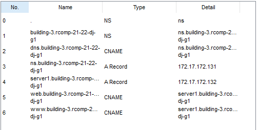

RCOMP 2021-2022 Project - Sprint 2 - Member 1200601 folder
===========================================

## ***Edifício 3***

#### Durante a realização do Sprint 2 de RCOMP, foi desenvolvida, no 'Cisco Packet Tracer', uma simulação da rede anteriormente realizada no sprint 1, para cada edifício. Cada elemento teve de adaptar as suas VLANs, as quais se encontram definidas no planning, e os respetivos IPs (IPv4 Networks) com uma simulação funcional.

###

## *DNS*

| Name                                 | Type     | Detail                               |
|--------------------------------------|----------|--------------------------------------|
| building-3.rcomp-21-22-dj-g1         | NS       | ns.building-3.rcomp-21-22-dj-g1      |
| dns.building-3.rcomp-21-22-dj-g1     | CNAME    | ns.building-3.rcomp-21-22-dj-g1      | 
| ns.building-3.rcomp-21-22-dj-g1      | A RECORD | 172.17.172.131                       |
| server1.building-3.rcomp-21-22-dj-g1 | A RECORD | 172.17.172.132                       | 
| web.building-3.rcomp-21-22-dj-g1     | CNAME    | server1.building-3.rcomp-21-22-dj-g1 | 
| www.building-3.rcomp-21-22-dj-g1     | CNAME    | server1.building-3.rcomp-21-22-dj-g1 |

##  VoIP

### Building 3

| Ephone | Number    |
|--------|-----------|
| 1      | 966555030 |
| 2      | 966555031 | 

## OSPF

| Network-Adress | Network-Wildcard | Area Number |
|----------------|------------------|-------------|
| 172.17.168.0   | 0.0.0.127        | 0           |
| 172.17.172.128 | 0.0.0.63         | 3           | 
| 172.17.172.0   | 0 0.0.63         | 3           |
| 172.17.171.64  | 0.0.0.63         | 3           | 
| 172.17.172.192 | 0.0.0.31         | 3           | 
| 172.17.173.32  | 0.0.0.31         | 3           |